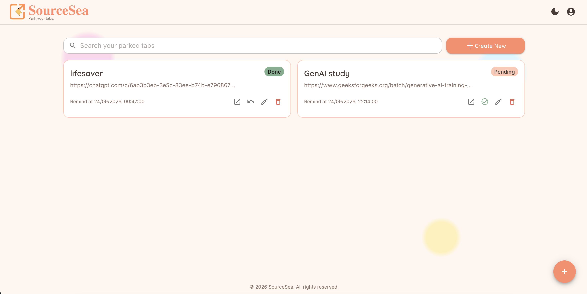
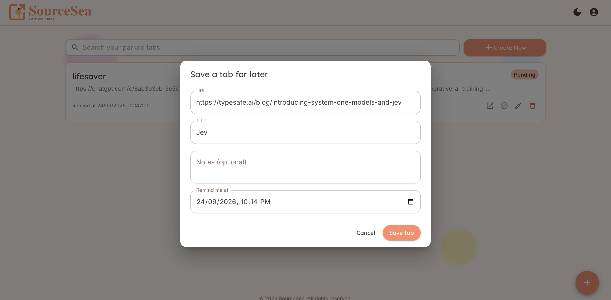
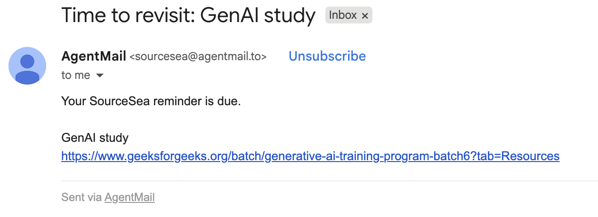

# 	📑 SourceSea

> Park the tabs you don't need right now, and get reminded when it's time to come back to them.

 🎥 [Live Demo](https://sourcesea-chi.vercel.app)

## Tech Stack


## Contents

- [Problem](#problem)
- [Solution](#solution)
- [How to Use](#how-to-use)
- [Screenshots](#screenshots)
- [Tech Stack](#tech-stack)
- [Project Structure](#project-structure)
- [Local Setup](#local-setup)
- [Future Improvements](#future-improvements)

## Problem

I constantly end up with tabs that I want to read later, but don't actually need open right now.

Closing them means I might forget about them. Keeping them open means eventually having way too many tabs sitting around, all waiting for "sometime later."

I wanted a simple way to park those links somewhere, decide when I want to come back to them, and get them out of my browser in the meantime.

You might say we can bookmark it, but how often do we ever go and open Bookmarks on Chrome? I have like 200+ bookmarks sitting, some of them dont even exist anymore lol.

## Solution

SourceSea lets you save a URL along with a title, optional notes, and a reminder date/time.

Once a reminder is set, SourceSea schedules an email for that time. You can close the original tab and move on without worrying about remembering the link yourself. It sends you the reminder you need to visit your bookmarked URL.

The basic idea is:

**Save it → Close the tab → Forget about it → Get reminded → Come back to it**

You can also edit a saved resource later. If you change the reminder time, the scheduled email is updated. If you delete the resource, its scheduled email is cancelled as well.

SourceSea also supports browser notifications while the app is open.

## How to Use

### 1. Sign in

Sign in with your Google account.

### 2. Park a resource

Add the URL you want to save, give it a title, and optionally add notes.

Choose when you want to be reminded.

### 3. Close the tab

Once the resource is saved, you don't need to keep the original tab open.

### 4. Get reminded

When the reminder time arrives, SourceSea sends an email containing the saved link and any notes you added.

If SourceSea is open, you can also receive a browser notification.

### 5. Manage your resources

You can edit, reschedule, mark as done, dismiss, or delete saved resources from the dashboard.

Each user can have up to 10 active scheduled email reminders.

## Screenshots

### Dashboard



### Add a Resource



### Reminder Email



> Screenshots coming soon.

## Tech Stack

| Technology | Used for |
| --- | --- |
| React + TypeScript + Vite | Frontend application |
| MUI | UI components and styling |
| Node.js + Express | Backend REST API |
| PostgreSQL | Resource and reminder data |
| `pg` | PostgreSQL access using raw SQL |
| Supabase | Google authentication and user management |
| AgentMail | Scheduled reminder emails |
| Vercel | Frontend deployment |
| Render | Backend deployment |

I used raw SQL through `pg` instead of an ORM. The data model is small enough that keeping the queries explicit made more sense for this project.

## Project Structure

```text
sourcesea/
├── frontend/   # React + TypeScript application
└── backend/    # Express API, PostgreSQL, auth and reminder logic
```
The frontend contains the UI, API client, resource state and browser notification handling.

The backend handles authentication, resource CRUD, PostgreSQL queries and scheduled email reminders.

## Local Setup
Prerequisites

Make sure you have:

Node.js
PostgreSQL
A Supabase project
An AgentMail account


**1. Clone the repository**
```
git clone https://github.com/jaeytea/sourcesea.git
cd sourcesea
```


**2. Set up the database**

Create a PostgreSQL database and run the schema:

```
createdb sourcesea
psql sourcesea -f backend/db/schema.sql
```


**3. Set up the backend**
```
cd backend
npm install
cp .env.example .env
```
Add the required environment variables to backend/.env.

Then start the backend:

```
npm run dev
```

The API will run on:

http://localhost:4000


**4. Set up the frontend**

Open another terminal:
```
cd frontend
npm install
cp .env.example .env
npm run dev
```
The frontend will run on:
http://localhost:5173

## Future Improvements

Some things I'd like to explore next:

- Recurring reminders
- AI Integration/quick legal scraping of resource to summarise the URL saved
- Snoozing reminders
- Tags and folders
- Bulk actions
- Web Push notifications
- Email/SMTP using self-owned domain

For now, SourceSea is intentionally focused on one simple workflow:

Park a tab now. Come back to it when it actually matters.

Try the Live Demo, and if you think this is needed, star the repo so I can scale it for multiple users.
